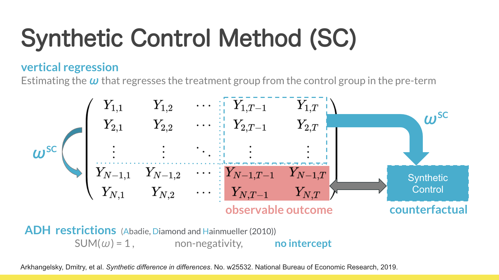
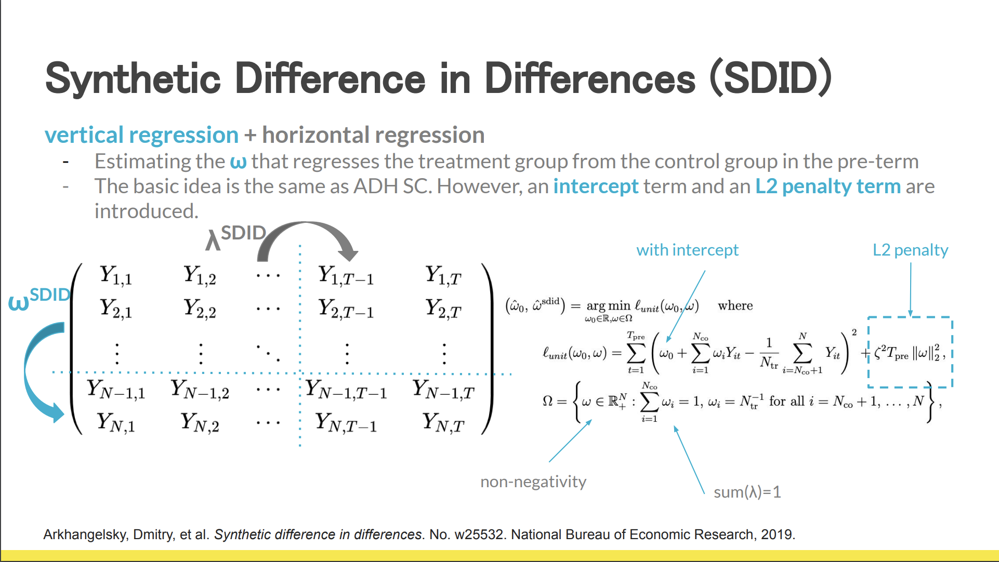
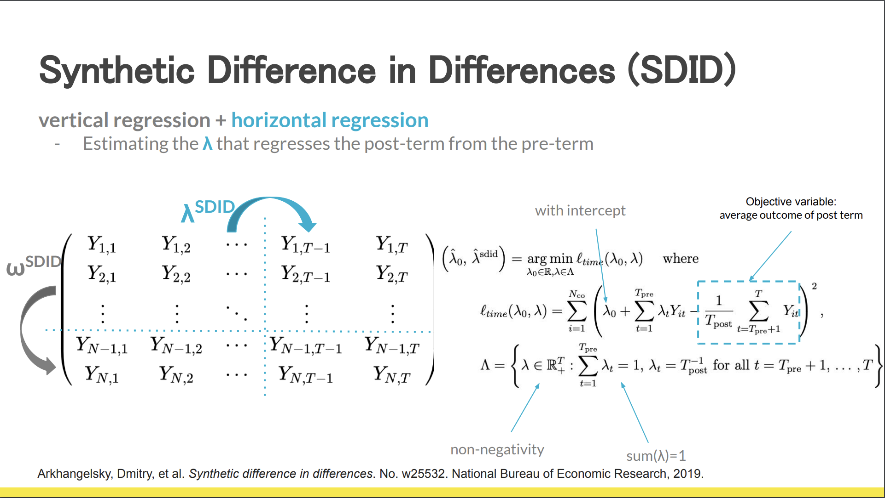
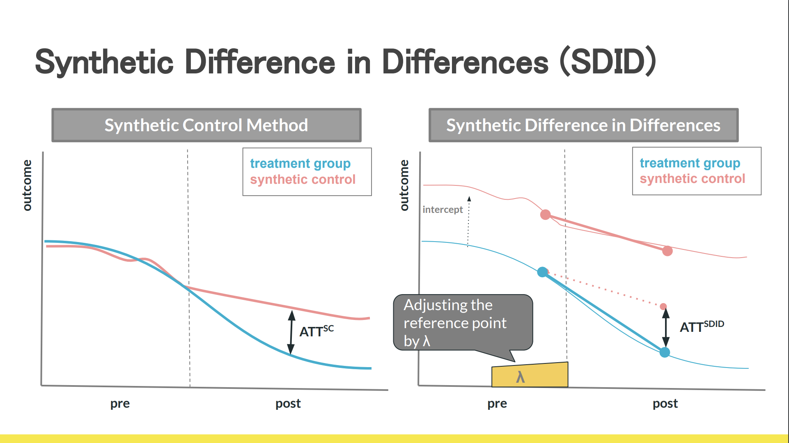
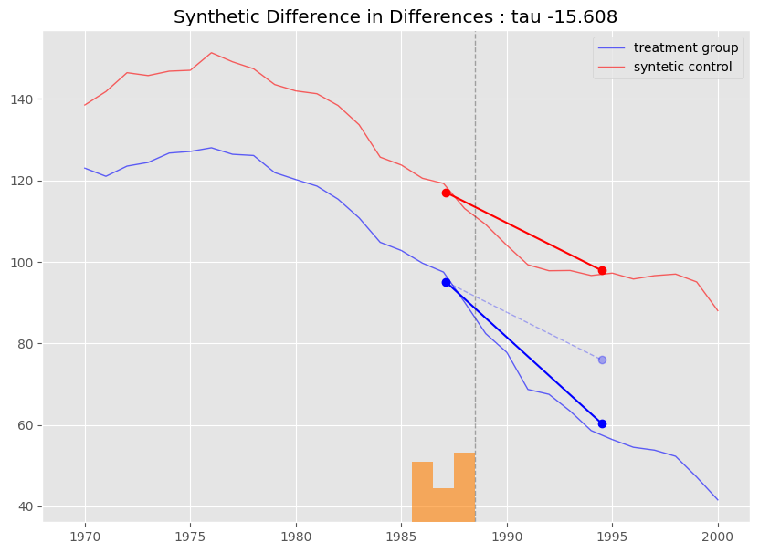

# pysynthdid : Synthetic difference in differences for Python

## What is Synthetic difference in differences:
### original paper:
Arkhangelsky, Dmitry, et al. Synthetic difference in differences. No. w25532. National Bureau of Economic Research, 2019. https://www.nber.org/papers/w25532
### R pkg:
https://github.com/synth-inference/synthdid






## Installation
This package is still under development. We will create `setup.py` after the following specifications are met.
  - Refactoring and better documentation
  - Completion of the TEST code

## How to use:
### Here's a simple example :
- setup
```python
from synthdid.model import SynthDID
from synthdid.sample_data import fetch_CaliforniaSmoking

df = fetch_CaliforniaSmoking()

PRE_TEREM = [1970, 1988]
POST_TEREM = [1989, 2000]

TREATMENT = ["California"]
```
- estimation & plot
```python
sdid = SynthDID(df, PRE_TEREM, POST_TEREM, TREATMENT)
sdid.fit(zeta_type="base")
sdid.plot(model="sdid")
```


- Details of each method will be created later.
### See the jupyter notebook in [`notebook`](https://github.com/MasaAsami/pysynthdid/tree/main/notebook) for basic usage
- `ReproductionExperiment_CaliforniaSmoking.ipynb`
  - This is a reproduction experiment note of the original paper, using a famous dataset (CaliforniaSmoking).

- `OtherOmegaEstimationMethods.ipynb`
  - This note is a different take on the estimation method for parameter `omega` (& `zeta` ). As a result, it confirms the robustness of the estimation method in the original paper.

- `ScaleTesting_of_DonorPools.ipynb`
  - In this note, we will check how the estimation results change with changes in the scale of the donor pool features.
  - Adding donor pools with extremely different scales (e.g., 10x) can have a significant impact (bias) on the estimates. 
  - If different scales are mixed, as is usually the case in traditional regression, preprocessing such as logarithmic transformation is likely to be necessary

## Warning:
- This module is still under development. 
- If you have any questions or comments, please feel free to use issues.
